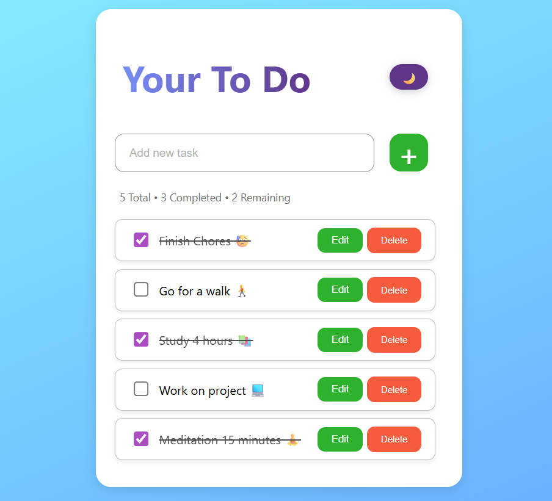
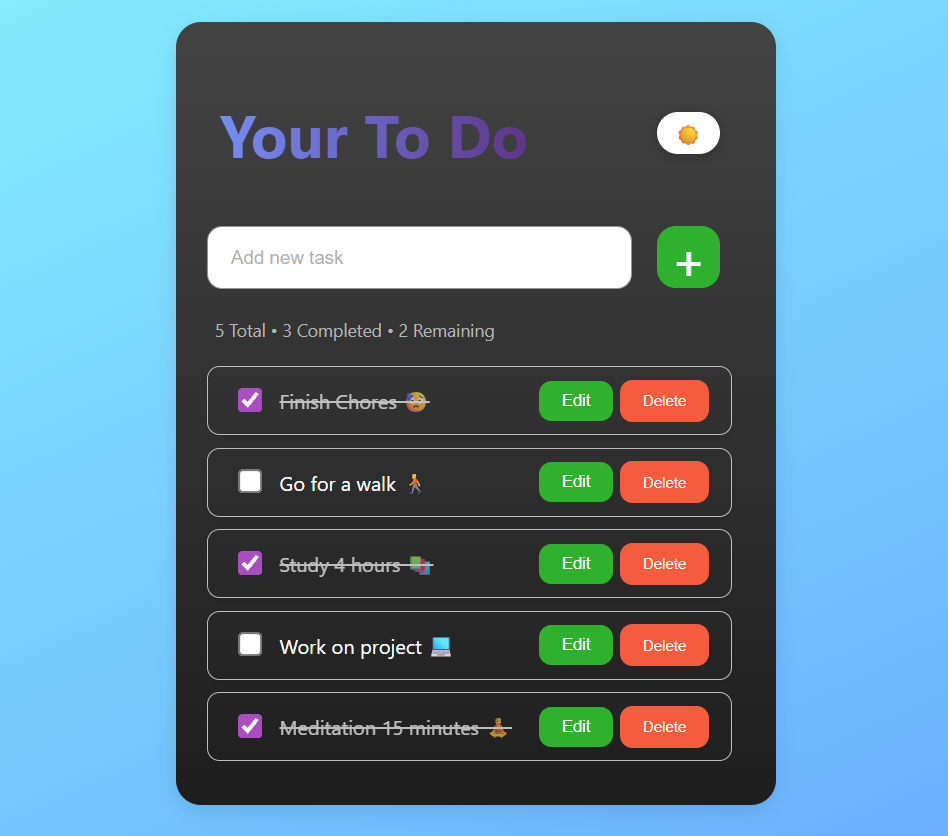
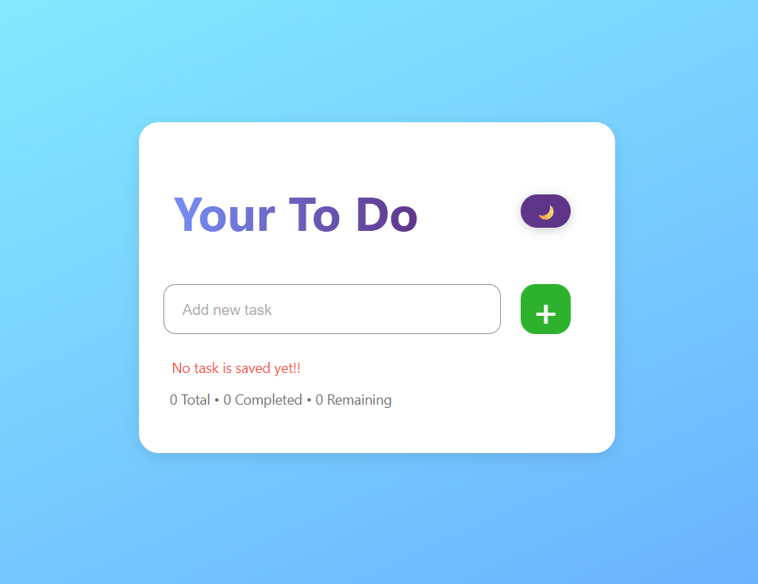

# 🚀 Responsive Task Manager

I built this project to get more comfortable with JavaScript DOM manipulation and localStorage. It started as a simple "add and delete tasks" app, but as I kept working on it, I ended up adding more features and improving the overall user experience.

### ✨ Features

* Add new tasks
* Edit existing tasks
* Delete tasks
* Mark tasks as completed
* Dark / Light mode
* Theme preference saved after refresh
* Task completion persistence
* Task statistics (Total, Completed, Remaining)
* Responsive layout for different screen sizes

### 🛠️ How I Built It

Everything was built using vanilla HTML, CSS, and JavaScript.

Tasks are stored in localStorage so they stay available after refreshing the page. During development I realized storing tasks as simple strings wasn't enough, especially when I wanted completed tasks to remain checked after refresh.

To solve that, I refactored the data structure and started storing tasks as objects:

```js
{
  text: "Study JavaScript",
  completed: true
}
```

That change made the app much easier to extend and manage.

### 📚 What I Learned

This project taught me much more than I expected:

* DOM manipulation
* Event handling
* localStorage
* Array methods like `map()`, `filter()`, and `forEach()`
* Updating UI based on application state
* Responsive design with Flexbox
* Dark mode implementation
* Structuring JavaScript into reusable functions
* Debugging real-world UI issues

One of the biggest lessons was understanding that the array should be the source of truth, and the UI should simply reflect that data.

### 🔮 Possible Improvements

Things I'd like to add in future versions:

* Drag and drop task reordering
* Task categories
* Due dates
* Priority levels
* Search and filtering
* Clear completed tasks button

### 💡 Final Thought

This project started as a small practice exercise, but it ended up teaching me how different parts of a frontend application work together—data, UI, localStorage, events, and state management.

Definitely one of the projects where I learned the most by building, breaking things, and fixing them.

## 📸 Screenshots

### 🌞 Light Mode



### 🌙 Dark Mode



### 📝 Empty State


